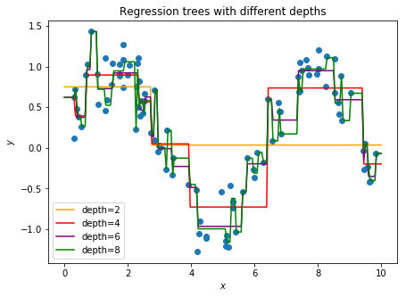
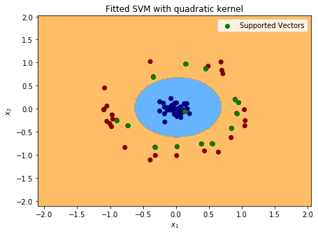
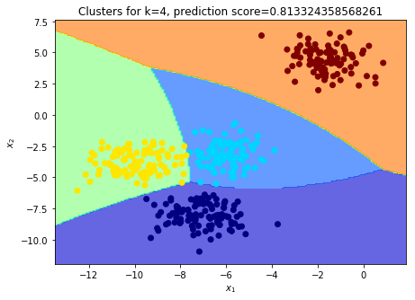

# Machine Learning in Numpy

Collection of Numpy implementations of some traditional ML algorithms. Visual
examples are provided in the form of jupyter notebooks.

I came up with the idea for this project when I started learning machine learning,
from-scratch implementations helps getting a good intuition about how and why
algorithms work. As a result this repository is my personal repertoire of such
implementations.

## Structure

Algorithms implementations are under the [models](./models/) directory.
Each model is defined in its own class. These implementations are not meant to
be optimal, but clear and easy to read.

To test whether models are working correctly some usage examples are drawn in
jupyter notebooks under the [notebooks](./notebooks/) folder.

Lastly helper functions are arranged into some modules under the [utils](./utils/)
directory. This methods encapsulate some code for trivial tasks like, loading a simple dataset or plotting a decision boundary, but that would result in an innecessary amount of code making notebooks harder to follow.

## Dependencies

* python3.6
* numpy
* scikit-learn
* matplotlib
* jupyter notebook

## Examples and reflections

Since I wanted to develop a well founded base for machine learning, I started
with some of the most basic models like [Linear Regression](./notebooks/linear-regression.ipynb) and [Logistic Regression](logistic-regression.ipynb).
There are however implementations of more complex models like [Decision Trees](
./notebooks/vanilla-decision-tree.ipynb) and [Random Forest](/notebooks/boston-dataset-trees.ipynb).

One of the main challenges I encountered was the training of a [SVM](./notebooks/svm-derivation.ipynb). Not many implementations are found doing a simple search in
Google. Moreover, in the literature it's easy to find the derivation of the objective function that needs to be optimized, but not how to do so, just that it can be
done using standard software for solving Quadratic Programming problems. I have
not gone deep enough into optimization theory yet to implement those solutions
using bare Numpy. Nevertheless, I managed to implement an algorithm to train SVMs using
a projected version of gradient descent, which may not be efficient, but works,
even with different types of [kernels](./notebooks/svm-kernels.ipynb).

There are also some unsupervised models like [K-Means](./notebooks/vanilla-kmeans.ipynb) and [GMM](vanilla-gmm.ipynb).

This project is in continuous development, there are still many algorithms left!
Besides I would like to include more elaborated examples of applications using
own implementations.

Please feel free to contact me if you have any suggestions or you have detected
a wrong implementation!

## License
**[MIT license](./LICENSE.md)**

## Acknowledgments

* [The hundred-page machine learning book](http://themlbook.com/): This book presents
a very good introduction to ML covering a lot of algorithms and with the enough
level of detail to gain a strong intuition about how they work.

* [ML-From-Scratch](https://github.com/eriklindernoren/ML-From-Scratch): A much
more comprehensive, and well built repo than this, but similar in the sense that
provides plain implementations of ML algorithms. It is great resource to check
when some implementations details are not very clear.
